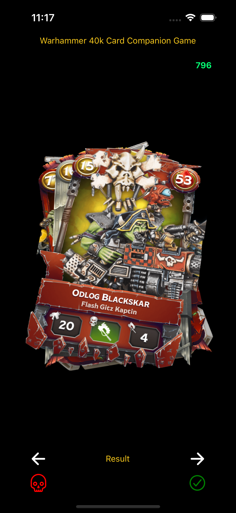

# Card Example

A card flipping animation example inspired by https://codesandbox.io/embed/j0y0vpz59

## Tech

- Bun
- Expo
- React native

### How to run the project

To run your project, navigate to the directory and run one of the following bun commands.

- bun run android
- bun run ios

### What is this?

This is a barebone companion app for the warhammer 40k card game. The lifepoints (the number marked as green at the top right corner) is the sum of all cards you have in your had lifepoints (the blood icon on each card).

On each round you are facing an oponent who also has this app. Whoever has the highest attack (gun icon on the left on the card) wins.

If your card is the winner you swipe on the right, if you failed the check you swipe on the left.

When swiping on the left, your lifepoints are reduced by the amount of the cards lifepoints.

### Example 
